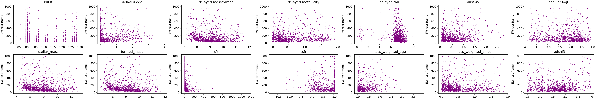

# Elements of Machine Learning

This repository houses the data and code I used when I took the Elements of Machine Learning class at UT Austin during the Spring of 2025. The course itself taught the basics of various ML Algorithms such as:

- Regression (Linear and Logistic)
- SVM (Support Vector Machines)
- KNN (K Nearest Neighbors)
- Random Forrest, Boosting and Bagging Techniques (XGBoost)
- Classification and Predictions

We also learned about the importance of the data quality in the testing and training set, as well as approaches to validate a prediction and useful metrics to determine one model over another one. We learned about techniques such as: 

- Cross-Validation, K-Fold Validation
- Parameter Tuning and Estimation for optimal ML inferences
- MSE, RMSE, R2 Evaluation

The directories in this repository hold the code that I wrote and used in the class. The main ones to look through are the *ISLP_Code*. This directory has code that I used to answer problems from the ISLP book as part of our problem sets. Note that while I have all the questions in the notebooks since we did the homework in groups I did not answer all the questions. Only the sections with code, were the ones I was tasked with answering. 

The entire data files we had is stored in the *Data* Directory, and we only used a couple of the Datasets for the homework and so there is a Separate Homework_Data directory that houses those datasets. 

In this class we were tasked with a final project to use ML to make inferences and predictions. I decided to lead a team of 4 in a model optimization test to see which ML model can best predict an observables seen in very distant galaxies. I was in charge of testing how well a Neural Network can predict this observable. I made 3 different NN architectures, representing different depths and layers and even folding in K-fold validation during the training phase to see if k-fold can be used to improve accuracy.

The skills that were gained throughtout the course: 

Coding: 
- pandas, 
- scikit-learn 
- visualization (matplotlib, seaborn)

ML/Data Analysis
- EDA 
- Feature Engineering 
- Regression (Lasso, Ridge, Logistic)
- Tree based ML Models (Random Forrest, XGBoost)
- KNN

## EDA: 
Exploratory Data Analysis (EDA) is a fundamental step in understanding structure and relationships within a dataset prior to model development. In this project, EDA was used to identify potential correlations between input features and to assess how variables relate to the target quantity of interest.

One common diagnostic tool is the correlation matrix, which provides a visual summary of pairwise linear relationships among features. Strong correlations between predictors may indicate redundancy and potential multicollinearity concerns during model training. The correlation structure of the dataset is shown below.

In addition to correlation analysis, examining the relationship between individual features and the target variable helps evaluate potential predictive signals within the data. Scatter plots were generated to visualize how the target variable varies as a function of each input feature. This allows for qualitative assessment of monotonic trends, nonlinear structure, and dispersion patterns that may influence model selection and feature engineering strategies.

## Testing Model Complexity
Prior to model deployment, rigorous validation is necessary to ensure that the model achieves an appropriate balance between bias and variance while utilizing informative and non-redundant features. Feature diagnostics were used to assess the suitability of predictors for model training.

Variance Inflation Factor (VIF) analysis was employed to evaluate multicollinearity among predictors. High VIF values indicate strong linear dependence between features, which can lead to inflated coefficient uncertainty and unstable parameter estimates during model inference.

Additionally, analysis of variance (ANOVA) was used to quantify the marginal contribution of features toward explaining the variability in the target variable. Sequential variance decomposition provides insight into feature importance within nested model structures.

Model complexity was further controlled by examining performance as a function of feature count, helping to mitigate overfitting and identify an optimal subset of predictors.

## Parameter Estimation
Once relevant features have been selected or engineered, the next step is model hyperparameter optimization. In this project, a grid search approach was used to systematically explore the hyperparameter space and identify parameter combinations that improve model performance. Grid search evaluates model performance across a predefined set of parameter values, allowing for empirical selection of hyperparameters that balance model bias and variance.

This approach ensures that model tuning is performed in a structured and reproducible manner, rather than relying on manual parameter selection. Below we show such as an analysis of the hyper parameter lambda used in the Ridge Regression. 

## Inference and Predictions

Model evaluation and inference are critical components of the machine learning pipeline. After training, models were assessed using multiple performance metrics to evaluate predictive accuracy and generalization capability.

For regression tasks, error-based metrics such as Root Mean Squared Error (RMSE), Mean Squared Error (MSE), and the coefficient of determination(R2) were used to quantify prediction quality and explain variance in the target variable.

For classification tasks, evaluation metrics including accuracy and recall were considered to assess model performance across different decision criteria. In particular, the confusion matrix provides a detailed visualization of prediction outcomes by comparing true labels against model predictions.

The confusion matrix below illustrates model performance for a logistic regression classifier trained to predict heart disease presence using physiological features from the dataset.

## Final Project
The culmination of the course was a final machine learning project designed to apply predictive modeling techniques to a scientific problem. For this project, I explored whether machine learning models could be used to predict an observable quantity associated with galaxies. As team leader, I contributed the dataset preparation and established a framework for model comparison, allowing group members to experiment with different algorithms while evaluating performance using RMSE as the primary comparison metric.

To capture potential nonlinear relationships between input features and the target observable I opted to use a neural network architecture. Neural networks are particularly well-suited for learning complex functional mappings between features and observables. Initial experiments began with a two-layer network and progressively increased model depth up to four layers to evaluate performance scaling with model complexity. Model training was monitored using loss-versus-epoch curves.

To further improve generalization performance, cross-validation was incorporated into the training procedure, which helped stabilize predictive accuracy and reduce overfitting.

After model training, predictions were evaluated by comparing model outputs against true values using parity plots. The model demonstrated strong agreement between predicted and observed values, indicating that the neural network successfully captured the underlying nonlinear mapping between input features and the target observable.

Finally, multiple machine learning models were compared to assess relative predictive performance. Surprisingly, the gradient boosting model achieved the lowest RMSE among the four evaluated models, outperforming the neural network architecture in this task.

