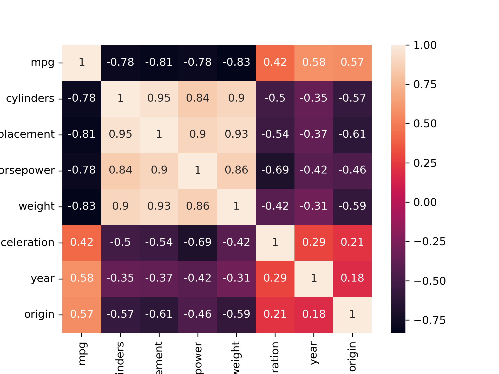
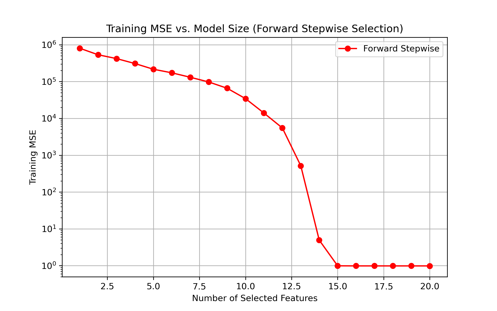
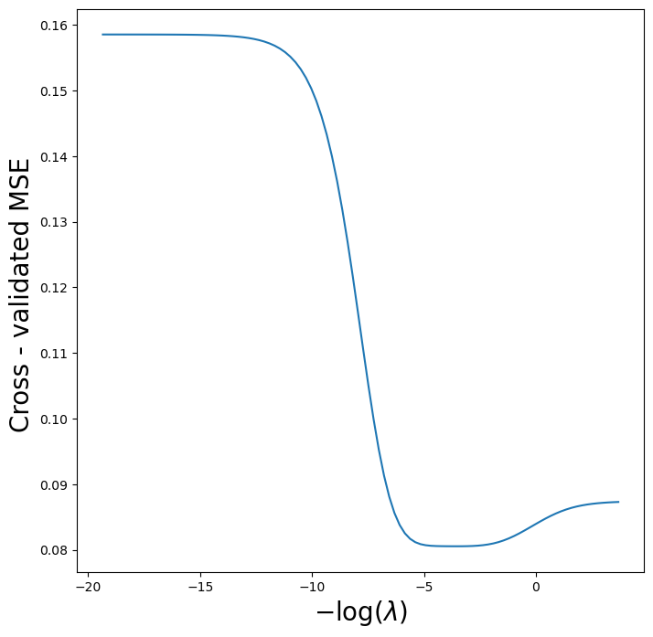
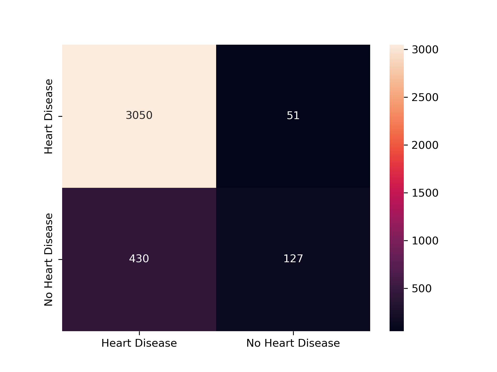
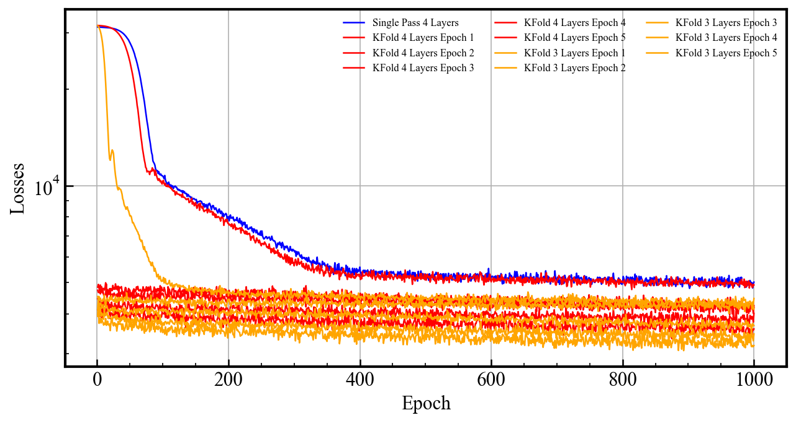
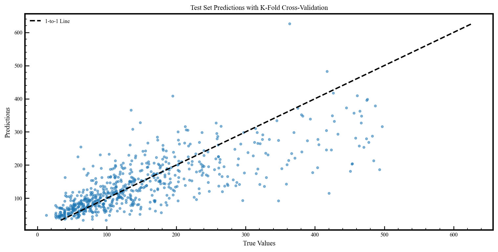
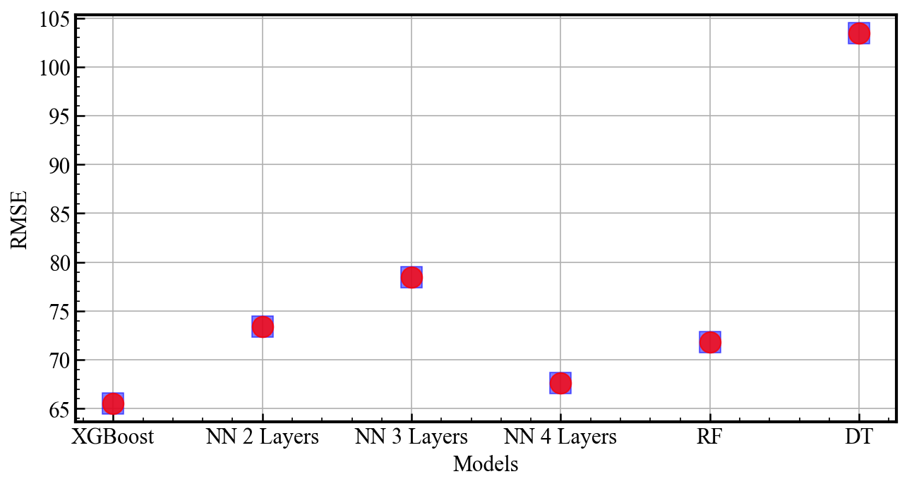

# Elements of Machine Learning

This repository houses the data and code I used when I took the Elements of Machine Learning class at UT Austin during the Spring of 2025. The course itself taught the basics of various ML Algorithms such as:

- Regression (Linear and Logistic)
- SVM (Support Vector Machines)
- KNN (K Nearest Neighbors)
- Random Forrest, Boosting and Bagging Techniques (XGBoost)
- Classification and Predictions

We also learned about the importance of the data quality in the testing and training set, as well as approaches to validate a prediction and useful metrics to determine one model over another one. We learned about techniques such as: 

- Cross-Validation, K-Fold Validation
- Parameter Tuning and Estimation for optimal ML inferences
- MSE, RMSE, R2 Evaluation

The directories in this repository hold the code that I wrote and used in the class. The main ones to look through are the *ISLP_Code*. This directory has code that I used to answer problems from the ISLP book as part of our problem sets. Note that while I have all the questions in the notebooks since we did the homework in groups I did not answer all the questions. Only the sections with code, were the ones I was tasked with answering. 

The entire data files we had is stored in the *Data* Directory, and we only used a couple of the Datasets for the homework and so there is a Separate Homework_Data directory that houses those datasets. 

In this class we were tasked with a final project to use ML to make inferences and predictions. I decided to lead a team of 4 in a model optimization test to see which ML model can best predict an observables seen in very distant galaxies. I was in charge of testing how well a Neural Network can predict this observable. I made 3 different NN architectures, representing different depths and layers and even folding in K-fold validation during the training phase to see if k-fold can be used to improve accuracy.

The skills that were gained throughtout the course: 

Coding: 
- pandas, 
- scikit-learn 
- visualization (matplotlib, seaborn)

ML/Data Analysis
- EDA 
- Feature Engineering 
- Regression (Lasso, Ridge, Logistic)
- Tree based ML Models (Random Forrest, XGBoost)
- KNN

## EDA: 

## Testing Model Complexity

## Parameter Estimation

## Inference and Predictions

## Final Project

